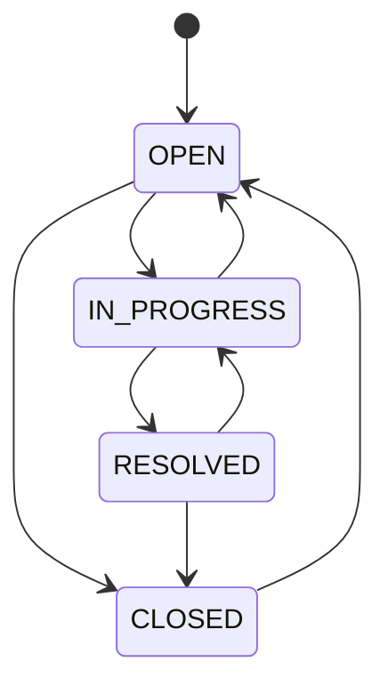

# Ticket state machine

Canonical statuses (must match [data-model.md](data-model.md) and [api-contract.md](api-contract.md)):

- `OPEN` — newly created, or reopened; not actively worked
- `IN_PROGRESS` — an agent is working the ticket
- `RESOLVED` — agent believes the issue is fixed; waiting for close
- `CLOSED` — done; read-only except reopen

## Diagram

## Allowed transitions

| From | To | When |
| --- | --- | --- |
| `OPEN` | `IN_PROGRESS` | Agent starts work (typically after assign) |
| `OPEN` | `CLOSED` | Duplicate / won’t fix without work |
| `IN_PROGRESS` | `RESOLVED` | Fix applied |
| `IN_PROGRESS` | `OPEN` | Park / unassign work |
| `RESOLVED` | `CLOSED` | Confirmed done |
| `RESOLVED` | `IN_PROGRESS` | Fix failed; resume work |
| `CLOSED` | `OPEN` | Reopen |

All other pairs are illegal and must return HTTP **409**.

## Side rules

- Create always lands in `OPEN`.
- Assignment does not by itself change status.
- Comments: allowed in `OPEN`, `IN_PROGRESS`, `RESOLVED`; **not** in `CLOSED`.
- While `CLOSED`, only the reopen transition (`status` → `OPEN`) is a valid PATCH; title, description, priority, and assignee must not change.
- Reopen (`CLOSED` → `OPEN`) does not clear assignee.
